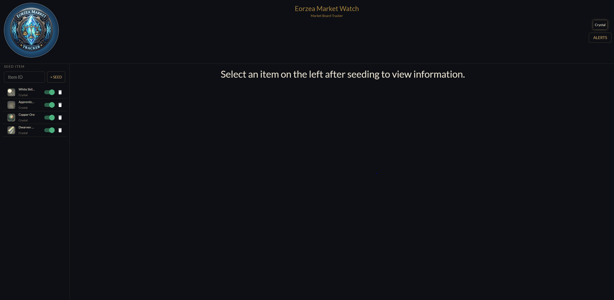
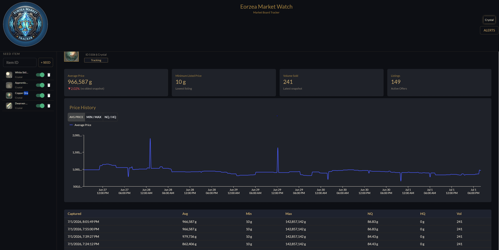

# Eorzea Market Watch

A full-stack market board tracker for Final Fantasy XIV, built as a portfolio project. Track item prices across worlds, view historical price data, and set price alerts — all powered by live data from the [Universalis](https://universalis.app) API.

**Live Demo:** https://ffxiv-market-tracker-web.vercel.app/
> Demo credentials — username: `demo` / password: `demo`




---

## Features

- **Live market data** — fetches real-time price snapshots from the Universalis public API
- **Automatic polling** — a background scheduler refreshes tracked item prices every 15 minutes
- **Price history graphs** — visualize average, min/max, and NQ/HQ price trends over time
- **Price alerts** — set ABOVE/BELOW thresholds on any tracked item and world
- **Item tracking** — add items by ID, toggle tracking on/off, remove items from your watchlist
- **Snapshot table** — paginated history of every captured price snapshot per item

---

## Tech Stack

### Backend
- **Java 23** / **Spring Boot 4.0.6**
- **Spring WebFlux** (WebClient for external API calls)
- **Spring Data JPA** / **Hibernate 7**
- **PostgreSQL 16**
- **Lombok**
- **JUnit 5** / **Mockito** (service layer unit tests)

### Frontend
- **React 18** / **Vite**
- **Material UI (MUI)** + `@mui/x-charts`
- **Emotion**

### Infrastructure
- **Railway** — backend + PostgreSQL hosting
- **Vercel** — frontend hosting

---

## Architecture

The backend exposes a REST API consumed by the React frontend. A scheduled job (`@Scheduled`) runs every 15 minutes, fetching fresh price snapshots from Universalis for all actively tracked items and checking whether any price alerts should trigger.

```
React (Vercel)
    ↕ /api/* (Vercel rewrite proxy)
Spring Boot (Railway)
    ↕ WebClient
Universalis API (external)
    ↕ JPA
PostgreSQL (Railway)
```

---

## API Endpoints

| Method | Path | Description |
|--------|------|-------------|
| POST | `/api/auth/login` | Login |
| POST | `/api/items/seed/{itemId}` | Seed item metadata from Universalis |
| GET | `/api/items/{id}` | Get item by ID |
| GET | `/api/items` | Get all items |
| POST | `/api/market/snapshot/{itemId}/{world}` | Capture price snapshot |
| GET | `/api/market/{itemId}/{world}/history` | Get snapshot history |
| POST | `/api/tracked` | Add tracked item |
| GET | `/api/tracked/user/{userId}` | Get user's tracked items |
| PATCH | `/api/tracked/user/{userId}/item/{itemId}` | Toggle tracking |
| DELETE | `/api/tracked/user/{userId}/item/{itemId}` | Remove tracked item |
| POST | `/api/alerts` | Create price alert |
| GET | `/api/alerts/user/{userId}` | Get user's alerts |
| DELETE | `/api/alerts/{alertId}` | Delete alert |

---

## Running Locally

### Prerequisites
- Java 23
- Docker (for PostgreSQL)
- Node.js 18+

### Backend

1. Start PostgreSQL via Docker:
```bash
docker run --name xiv-postgres -e POSTGRES_DB=xiv_market -e POSTGRES_USER=xiv_user -e POSTGRES_PASSWORD=yourpassword -p 5432:5432 -d postgres:16
```

2. Configure `src/main/resources/application.yml` with your local DB credentials.

3. Run the Spring Boot app:
```bash
./mvnw spring-boot:run
```

### Frontend

```bash
cd XIV-Frontend
npm install
npm run dev
```

The Vite dev server runs on `http://localhost:5173` and proxies `/api/*` to `http://localhost:8080`.

---

## Known Limitations

- Authentication uses plain-text password comparison — intentional for portfolio simplicity, not production use
- No JWT or session tokens — user ID is passed in requests directly
- Vendor-only items with no Universalis market data return a 500 error
- Price alert triggering is detected but no notification is sent to the user

---

## Future Improvements

- JWT-based authentication and proper session management
- User registration flow
- Duplicate alert prevention
- Email/push notifications when price alerts trigger
- BCrypt password hashing
- World selection on login/profile page
